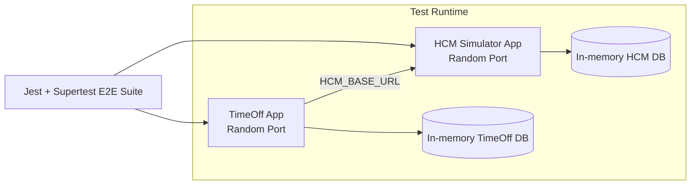

# Test Plan: ExampleHR Time-Off Microservice

## 1. Purpose

This document describes the test strategy for the ExampleHR Time-Off Microservice and separate HCM Simulator Service.

The goal is to verify balance integrity, lifecycle correctness, HCM realtime and batch sync behavior, idempotency, service separation, and defensive failure handling.

## 2. Testing Approach

The suite is integration/e2e-heavy because the main risk is cross-service behavior:

- TimeOff Service request lifecycle and local SQLite state.
- HCM Simulator Service realtime balance and apply APIs.
- HTTP communication between TimeOff and HCM.
- Batch sync reconciliation.
- Local reservation math.
- Approval-time HCM validation.
- Slow, unavailable, and unreachable HCM behavior.

Tests use Jest and Supertest. The e2e setup boots both NestJS apps on random ports, configures TimeOff with `HCM_BASE_URL`, and uses isolated in-memory SQLite databases for each service.

The matrix below is scenario-based, not a one-to-one list of Jest `it()` blocks. The automated suite currently has 37 e2e tests plus 9 focused unit tests; some e2e tests intentionally cover multiple related scenarios to keep setup readable.

## 3. Test Environment

- Framework: Jest
- HTTP testing: Supertest
- Runtime: NestJS testing modules
- Databases: separate in-memory SQLite databases
- Validation: global NestJS `ValidationPipe`
- HCM: separate HCM simulator NestJS app

Test runtime layout:



## 4. Automated Test Files

| File | Type | Purpose |
|---|---|---|
| `test/app.e2e-spec.ts` | Integration/e2e | Boots both services and verifies request lifecycle, balance integrity, HCM sync, idempotency, failure handling, and service separation |
| `test/day-utils.spec.ts` | Unit | Covers day conversion, invalid number handling, decimal precision, positive/non-negative behavior, and hundredths normalization |
| `test/hash.spec.ts` | Unit | Covers stable serialization and deterministic hashing for idempotency payloads |

## 5. Coverage Summary

Latest coverage is recorded in `docs/COVERAGE_SUMMARY.md`.

The generated `coverage/` folder is excluded from the distribution archive to keep the package small.

## 6. Test Case Matrix

| ID | Area | Test Case | Expected Result |
|---|---|---|---|
| TC-001 | Health | Both service health endpoints work | TimeOff and HCM return 200 |
| TC-002 | Separation | TimeOff does not expose HCM simulator routes | TimeOff returns 404 |
| TC-003 | Separation | Service databases are isolated | Each DB contains only its own tables |
| TC-004 | Batch Sync | Batch sync creates balance | Balance is created for employee/location |
| TC-005 | Batch Sync | Batch sync updates balance | Existing balance is updated |
| TC-006 | Batch Sync | Same batchId and same payload | Returns idempotent success |
| TC-007 | Batch Sync | Same batchId and different payload | Returns 409 conflict |
| TC-008 | Batch Sync | Empty balance corpus is rejected | Returns 400 |
| TC-009 | HCM Batch | HCM simulator pushes corpus to TimeOff | TimeOff balance cache updates |
| TC-010 | Balance | Balance endpoint returns cached/reserved/available days | Correct availability calculation |
| TC-011 | Balance Freshness | Cached balance response includes age and freshness metadata | Response contains `lastSyncedAt`, `balanceAgeSeconds`, `isFresh`, `isStale`, and `staleAfterSeconds` |
| TC-012 | Balance Freshness | Stale cached display can be refreshed from HCM | `fresh=true` updates cache and returns current HCM-backed availability |
| TC-013 | Manager Validation | Manager validates a pending request after HCM decreases | Validation refreshes HCM and returns `canApprove=false` |
| TC-014 | Manager Validation | HCM unavailable during manager validation | Returns 503 and does not change request state |
| TC-015 | Request Creation | Create request with sufficient balance | Request becomes `PENDING` |
| TC-016 | Request Creation | Create request with insufficient balance | Returns 409 |
| TC-017 | Request Creation | Missing cache triggers HCM refresh | Local balance is seeded from HCM |
| TC-018 | Request Creation | Stale low cache refreshes before rejection | HCM refresh allows request if balance is enough |
| TC-019 | Request Creation | Stale high cache is lower in HCM | Returns 409 and creates no request |
| TC-020 | Failure | HCM unavailable during required refresh | Returns 503 and creates no request |
| TC-021 | Failure | HCM network unreachable | Returns 503 and creates no request |
| TC-022 | Failure | HCM realtime API times out | Returns 503 and creates no request |
| TC-023 | Reservation | `APPROVING` request reserves balance | Available balance includes `APPROVING` reservation |
| TC-024 | Reservation | Concurrent requests cannot overspend same balance | One succeeds and one fails |
| TC-025 | Scope | Balances are isolated by employee/location | Reservation affects only matching pair |
| TC-026 | Validation | Invalid day values are rejected | Returns 400 |
| TC-027 | Validation | Invalid HCM dimension is rejected | Returns 404 |
| TC-028 | Validation | Utility conversion rejects invalid/over-precise days | Unit tests throw `BadRequestException` |
| TC-029 | Idempotency | Same create idempotency key and payload | Returns original request |
| TC-030 | Idempotency | Same create idempotency key and different payload | Returns 409 |
| TC-031 | Idempotency | Stable payload hashing is deterministic | Unit tests produce same hash for reordered objects |
| TC-032 | Query | List/filter requests | Returns matching requests only |
| TC-033 | Query | Fetching a missing request | Returns 404 |
| TC-034 | Approval | Approval succeeds when HCM has balance | Request becomes `APPROVED` and HCM deducts |
| TC-035 | Approval | Approval updates local cache | Local balance reflects HCM result |
| TC-036 | Approval | HCM balance decreased externally | Approval fails safely with 409 |
| TC-037 | Approval | HCM apply is unreliable | TimeOff rejects before apply when realtime HCM balance is insufficient |
| TC-038 | Approval | HCM unavailable during approval | Request returns to `PENDING` and response is 503 |
| TC-039 | Approval | HCM timeout during approval | Request returns to `PENDING` and response is 503 |
| TC-040 | Approval | Double approval attempt | HCM is deducted only once |
| TC-041 | HCM | HCM apply replay with same requestId | Does not deduct twice |
| TC-042 | Lifecycle | Retry approving already approved request | Returns existing approved request |
| TC-043 | Lifecycle | Reject pending request | Reservation is released |
| TC-044 | Lifecycle | Cancel pending request | Reservation is released |
| TC-045 | Lifecycle | Reject/cancel `APPROVING` request | Returns 409 |
| TC-046 | Lifecycle | Terminal statuses reject invalid transitions | Returns 409 |
| TC-047 | HCM Simulation | External HCM bonus/increase | Refresh updates local balance upward |
| TC-048 | HCM Simulation | External HCM decrease | Refresh updates local balance downward |
| TC-049 | Audit | Request events are persisted | Audit events exist |
| TC-050 | Audit | Sync events are persisted | Sync event exists |

## 7. Key Regression Risks Covered

- HCM source-of-truth violations from approving stale local balances.
- Misleading employee or manager balance displays from silently stale cache.
- Stale high cache creating a `PENDING` request HCM would already reject.
- Manager approving from stale request-detail context.
- Local overspending from multiple pending requests.
- Duplicate request creation from frontend retries.
- Duplicate HCM deductions from approval retries.
- Batch replay with mismatched payloads.
- Independent HCM balance changes from annual refreshes, work anniversaries, or corrections.
- HCM outage, timeout, and network failures.
- Accidental collapse of TimeOff and HCM back into one runtime/data model.

## 8. Manual Verification

Install and run both services:

```bash
pnpm install
pnpm run start:dev:hcm
HCM_BASE_URL=http://localhost:3001 pnpm run start:dev:timeoff
```

Seed HCM:

```bash
curl -X PUT http://localhost:3001/hcm-simulator/balances/emp-1/loc-1 \
  -H 'Content-Type: application/json' \
  -d '{"balanceDays":10}'
```

Create and approve a request through TimeOff:

```bash
curl -X POST http://localhost:3000/time-off-requests \
  -H 'Content-Type: application/json' \
  -H 'Idempotency-Key: create-emp-1-001' \
  -d '{"employeeId":"emp-1","locationId":"loc-1","days":2,"requestedBy":"emp-1"}'
```

```bash
curl -X POST http://localhost:3000/time-off-requests/<request-id>/approve \
  -H 'Content-Type: application/json' \
  -d '{"managerId":"manager-1"}'
```

Run automated verification:

```bash
pnpm run build
pnpm test:e2e
pnpm test:cov
```
