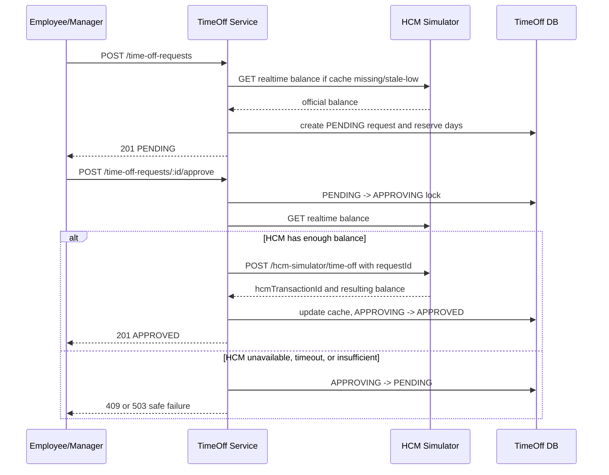
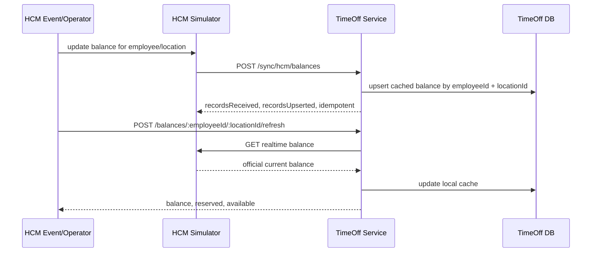

# Technical Requirements Document: ExampleHR Time-Off Microservice

## 1. Overview

ExampleHR is the employee-facing system where employees request time off. The Human Capital Management system (HCM), such as Workday or SAP, remains the source of truth for official employment and time-off balance data.

This project implements two independently runnable NestJS services in one repository:

- **TimeOff Service**: owns ExampleHR request lifecycle, local balance cache, reservations, audit events, and HCM batch ingestion.
- **HCM Simulator Service**: owns simulated HCM balances, HCM realtime APIs, idempotent HCM apply behavior, outage simulation, and batch push simulation.

The separation is intentional. TimeOff never imports HCM simulator repositories or entities. It calls HCM over HTTP through an HCM client, which better reflects the real system boundary described in the assignment.

### Assignment Alignment Summary

| Assignment Point | Design Response |
|---|---|
| HCM remains source of truth | TimeOff stores a cache only and revalidates with realtime HCM before approval |
| ExampleHR is not the only HCM updater | realtime refresh and batch sync handle anniversary bonuses, annual refreshes, corrections, and external updates |
| HCM realtime API exists | HCM simulator exposes realtime balance and apply APIs; TimeOff calls them over HTTP |
| HCM batch endpoint exists | TimeOff exposes batch ingestion, and HCM simulator can push its corpus to TimeOff |
| HCM errors may be unreliable | TimeOff checks balance before HCM apply and treats HCM/network/timeout failures as safe failures |
| Security and architecture are evaluated | TRD documents service boundary, data ownership, idempotency, validation, timeout, and production security gaps |
| Test suite rigor matters | e2e tests boot both services, use separate DBs, and cover failure modes and regression risks |

## 2. Problem Statement

Keeping time-off balances correct across ExampleHR and HCM is difficult because neither system alone has the full picture at every moment.

HCM is authoritative for official balances, but ExampleHR has local pending requests that may not be filed in HCM yet. HCM can also change independently through events outside ExampleHR, such as work anniversary bonuses, annual balance refreshes, corrections, or imports from other HR systems.

A local-only CRUD service would be fast but unsafe because it could approve against stale data. An HCM-only service would miss ExampleHR pending reservations and would make every employee interaction depend on HCM availability. The system therefore needs a hybrid model: local cached balances for fast feedback, local reservations for pending requests, realtime HCM validation before approval, and batch sync for reconciliation.

## 3. Goals

- Provide REST APIs for balance lookup, balance refresh, time-off request lifecycle, manager decisions, and HCM batch sync.
- Treat HCM as the source of truth for official balances.
- Keep pending ExampleHR requests from overspending local availability.
- Validate with realtime HCM immediately before approval.
- Handle HCM outages, invalid dimensions, insufficient HCM balance, stale local cache, replayed requests, and duplicate approvals safely.
- Provide a realistic HCM simulator as a separate microservice for tests and manual verification.
- Include a rigorous integration/e2e test suite and proof of coverage.

## 4. Non-Goals

- Real authentication, sessions, JWTs, or manager hierarchy authorization.
- Production deployment, cloud infrastructure, queues, distributed locks, or observability stack.
- HCM vendor-specific APIs or credentials.
- Leave types, accrual policy engines, holiday calendars, weekend calculations, or timezone-heavy date rules.
- Reversal of already-approved time off in HCM.

## 5. Assumptions

- Balances are scoped by `employeeId + locationId`, as required by the assignment.
- `days` is the source value for balance math; `startDate` and `endDate` are optional metadata.
- HCM deducts official balance only when a manager approves a request.
- `PENDING` and `APPROVING` ExampleHR requests reserve local availability.
- HCM may reject invalid dimensions or insufficient balance, but TimeOff still validates defensively before apply because external guarantees may be unreliable.
- TypeScript/NestJS satisfies the JavaScript requirement because the project compiles and runs as JavaScript.
- SQLite and an in-process write queue are acceptable for a single-process take-home; production would use stronger shared coordination.

## 6. User Personas

- **Employee**: wants to see an accurate available balance and receive instant feedback when submitting a request.
- **Manager**: needs to approve or reject requests knowing approval decisions use current HCM data.
- **System operator/reviewer**: needs deterministic setup, clear tests, and failure simulations that show the architecture is intentional.

## 7. Terminology

- **HCM**: external Human Capital Management system and source of truth for official balances.
- **TimeOff Service**: ExampleHR microservice that owns request workflow and local cached balance state.
- **HCM Simulator Service**: separate local service that simulates HCM realtime and batch behavior.
- **Cached balance**: latest known official HCM balance stored locally by TimeOff.
- **Reserved days**: days held by non-terminal local requests.
- **Available days**: `cached balance - reserved days`.
- **Batch sync**: HCM sending a corpus of balances to TimeOff.
- **Realtime refresh**: TimeOff asking HCM for one employee/location balance.

## 8. Functional Requirements

- TimeOff must return cached balance, reserved days, and available days for an employee/location.
- TimeOff must refresh one employee/location balance from realtime HCM.
- TimeOff must ingest HCM batch sync payloads idempotently.
- TimeOff must create time-off requests when available balance is sufficient.
- TimeOff must support create idempotency through `Idempotency-Key`.
- TimeOff must approve, reject, cancel, list, and fetch requests.
- Approval must validate current HCM balance before filing time off.
- HCM apply must be idempotent by request ID.
- HCM simulator must allow tests to seed balances, mutate balances, simulate invalid dimensions, simulate outages, and push batch syncs into TimeOff.
- HCM simulator must allow tests to simulate slow HCM responses so TimeOff timeout behavior can be verified.
- Request lifecycle and sync actions must be auditable.

## 9. Non-Functional Requirements

- Prefer correctness over optimistic success.
- Fail closed when HCM is unavailable during required refresh or approval.
- Use bounded outbound HCM HTTP calls so a slow HCM cannot hang TimeOff indefinitely.
- Avoid duplicate HCM deductions under retries or concurrent approvals.
- Keep setup simple: `pnpm install`, run two services, run tests.
- Keep packaged zip under 50 MB and exclude generated/heavy folders.

## 10. System Architecture

The system has two service processes:

```text
Employee/Manager/API Client
        |
        v
TimeOff Service :3000
  - request lifecycle
  - local balance cache
  - reservations
  - audit and sync history
  - SQLite: time-off.sqlite
        |
        | HTTP via HCM_BASE_URL
        v
HCM Simulator Service :3001
  - official simulated HCM balance state
  - realtime balance API
  - time-off apply API
  - failure simulation
  - batch push simulation
  - SQLite: hcm-simulator.sqlite
```

TimeOff owns no HCM simulator tables. HCM owns no TimeOff request or sync tables. This is verified by e2e tests.

Source code mirrors the same ownership boundary:

- `src/database/timeoff/` contains TimeOff-owned entities.
- `src/database/hcm-simulator/` contains HCM simulator-owned entities.
- `src/database/entities.ts` exports separate TypeORM entity lists for each app module.

### Key Architecture Decisions

- **Two services, one repo**: The submission keeps setup simple while preserving the real runtime boundary: two NestJS apps, two ports, two SQLite databases, and HTTP-only integration.
- **HCM as source of truth**: TimeOff never treats local cached balance as official during approval. It revalidates with realtime HCM before filing approved time off.
- **Hybrid consistency**: Cached balances give employees fast feedback; local reservations protect pending ExampleHR requests; realtime HCM validation protects final approval; batch sync reconciles external HCM changes.
- **Defensive integration**: TimeOff checks HCM balance before apply even though HCM may reject insufficient balance, because the assignment states HCM errors may not always be guaranteed.
- **Idempotency at boundaries**: Create requests, batch syncs, and HCM apply calls all use payload hashes or request IDs to make retries safe.
- **SQLite tradeoff**: SQLite is used because the assignment asks for it. Explicit write transactions are serialized for deterministic single-process tests; production would use database locks or a queue with shared coordination.

## 11. Data Model

### TimeOff Database

`balances`

- Latest known HCM balance per `employeeId + locationId`.
- Stores `balanceHundredths`, `lastSyncedAt`, `source`, and optional `externalVersion`.
- Unique `(employeeId, locationId)`.

`time_off_requests`

- Stores ExampleHR request workflow.
- Status values: `PENDING`, `APPROVING`, `APPROVED`, `REJECTED`, `CANCELLED`.
- Stores idempotency fields, approval lock fields, decision actor, and HCM transaction ID.

`request_events`

- Audit log for lifecycle events and approval failures.

`balance_sync_events`

- Records HCM batch sync attempts by `batchId` and payload hash.

### HCM Simulator Database

`hcm_simulator_balances`

- Official simulated HCM balance per `employeeId + locationId`.
- `isValid=false` simulates invalid HCM dimensions.

`hcm_simulator_applied_requests`

- Records applied request IDs and payload hashes so HCM apply is idempotent.

`hcm_simulator_config`

- Stores simulator failure flags such as `isUnavailable`, `forceApplySuccess`, and `responseDelayMs`.

## 12. API Design

### TimeOff Service

| Endpoint | Request | Success Response | Main Errors |
|---|---|---|---|
| `GET /health` | none | `{ status, service }` | none expected |
| `GET /balances/:employeeId/:locationId` | path params | `{ employeeId, locationId, balanceDays, reservedDays, availableDays, lastSyncedAt, source, externalVersion }` | `404` no local snapshot |
| `POST /balances/:employeeId/:locationId/refresh` | path params | same as balance response | `404` invalid HCM dimensions, `503` HCM unavailable/timeout |
| `POST /sync/hcm/balances` | `{ batchId, balances: [{ employeeId, locationId, balanceDays, externalVersion? }] }` | `{ batchId, status, recordsReceived, recordsUpserted, idempotent }` | `400` invalid payload, `409` batch replay mismatch |
| `POST /time-off-requests` | optional `Idempotency-Key`; `{ employeeId, locationId, days, startDate?, endDate?, reason?, requestedBy }` | request representation with `PENDING` status | `400` invalid input, `404` invalid HCM dimensions, `409` insufficient balance/idempotency conflict, `503` HCM unavailable/timeout |
| `GET /time-off-requests` | optional `employeeId`, `locationId`, `status` query filters | request array | `400` invalid status shape |
| `GET /time-off-requests/:id` | path param | request representation | `404` missing request |
| `POST /time-off-requests/:id/approve` | `{ managerId }` | approved request representation | `404` missing request, `409` invalid transition/insufficient HCM balance, `503` HCM unavailable/timeout |
| `POST /time-off-requests/:id/reject` | `{ managerId, reason? }` | rejected request representation | `404` missing request, `409` invalid transition |
| `POST /time-off-requests/:id/cancel` | `{ actorId, reason? }` | cancelled request representation | `404` missing request, `409` invalid transition |

### HCM Simulator Service

| Endpoint | Request | Success Response | Main Errors |
|---|---|---|---|
| `GET /health` | none | `{ status, service }` | none expected |
| `GET /hcm-simulator/balances/:employeeId/:locationId` | path params | `{ employeeId, locationId, balanceDays, externalVersion }` | `404` invalid dimensions, `503` simulated outage |
| `PUT /hcm-simulator/balances/:employeeId/:locationId` | `{ balanceDays, isValid? }` | `{ employeeId, locationId, balanceDays, externalVersion, isValid }` | `400` invalid payload |
| `POST /hcm-simulator/time-off` | `{ employeeId, locationId, days, requestId }` | `{ employeeId, locationId, balanceDays, hcmTransactionId, idempotent }` | `404` invalid dimensions, `409` insufficient balance/requestId mismatch, `503` simulated outage |
| `POST /hcm-simulator/config` | `{ isUnavailable?, forceApplySuccess?, responseDelayMs? }` | simulator config | `400` invalid payload |
| `POST /hcm-simulator/batch-push` | `{ batchId? }` | TimeOff batch sync result | `409` no valid balances, `503` TimeOff unavailable |
| `POST /hcm-simulator/reset` | none | `{ ok: true }` | none expected |

## 13. Request Lifecycle

Allowed transitions:

- `PENDING -> APPROVING -> APPROVED`
- `PENDING -> REJECTED`
- `PENDING -> CANCELLED`
- `APPROVING -> PENDING` when approval fails safely

Terminal states:

- `APPROVED`
- `REJECTED`
- `CANCELLED`

`APPROVING` is a transient lock state. Only the request that successfully moves from `PENDING` to `APPROVING` may call HCM apply.

### Approval Sequence



## 14. Balance Integrity Strategy

- Store day amounts as integer hundredths to avoid floating point drift.
- Calculate availability as `cached HCM balance - PENDING reservations - APPROVING reservations`.
- Seed missing local cache from realtime HCM during request creation.
- If local availability is too low, refresh from HCM once before rejecting.
- Validate realtime HCM balance before approval.
- Apply time off to HCM only after approval lock is acquired.
- Update local cache from HCM apply result after approval succeeds.
- Keep batch sync idempotent by `batchId + payloadHash`.
- Keep create idempotent by `Idempotency-Key + payloadHash`.
- Do not auto-cancel pending requests if HCM batch sync lowers balances; approval revalidates with HCM.

## 15. HCM Integration Model

Realtime HCM APIs are used for:

- Missing local cache refresh.
- Stale low-cache refresh before request rejection.
- Approval-time official balance validation.
- Filing approved time off.

Batch HCM sync is used for:

- Reconciliation after annual refreshes, work anniversary bonuses, external corrections, or non-ExampleHR updates.
- Bulk updates of cached TimeOff balances.
- Auditability of sync attempts.

The HCM simulator exposes both models. `POST /hcm-simulator/batch-push` lets the simulator push its current valid corpus to TimeOff's batch endpoint.

### Batch Sync and External Refresh Sequence



## 16. Failure Modes and Handling

- **HCM unavailable during create refresh**: return `503`; no request is created.
- **HCM network unreachable**: return `503`; no request is created or approved.
- **HCM realtime API timeout**: abort the outbound HCM call, return `503`, and do not create or approve the request.
- **Invalid HCM dimension**: return `404`; do not seed local cache.
- **Insufficient local availability**: refresh from HCM once; return `409` only if still insufficient.
- **HCM balance decreases before approval**: return `409`, revert `APPROVING` to `PENDING`, and do not apply to HCM.
- **HCM unavailable during approval**: return `503`, revert `APPROVING` to `PENDING`, and keep request retryable.
- **Duplicate approval attempt**: only one caller can enter `APPROVING`; the other receives conflict or the already-approved request.
- **HCM apply replay**: same `requestId + payload` returns the original HCM result without deducting twice.
- **HCM request ID reused with different payload**: return `409`.
- **Batch replay with same `batchId` and different payload**: return `409`.
- **HCM apply behavior unreliable**: TimeOff still checks realtime HCM balance before apply, so it does not rely only on HCM rejection.
- **Crash during `APPROVING`**: documented limitation; production would add an approval lease recovery job.

## 17. Security Considerations

- DTO validation is enabled globally with whitelist and non-whitelisted-field rejection.
- Day values are validated and stored as integer hundredths to avoid floating point drift and malformed balance math.
- TimeOff uses outbound HCM HTTP timeouts through `HCM_TIMEOUT_MS` to avoid request exhaustion from slow dependencies.
- HCM simulator endpoints are test/development endpoints and should not be exposed publicly in production.
- Actor fields are audit metadata only; production would require authentication and manager authorization.
- No secrets are committed.
- Errors use NestJS HTTP exceptions rather than raw stack traces.
- Production HCM HTTP calls would require TLS, credentials, request signing or OAuth, retries, circuit breakers, and structured logging.
- The simulator batch push target is environment-controlled for this take-home; production systems should avoid arbitrary callback targets.
- Production should restrict CORS, add rate limiting, protect write endpoints, and store secrets in a secret manager rather than environment files.

## 18. Testing Strategy

The test suite is integration/e2e-heavy because the main risk is cross-service behavior rather than isolated helper logic. Tests boot both services on random ports, configure TimeOff with `HCM_BASE_URL`, and use separate in-memory SQLite databases.

Focused unit tests cover shared utility behavior that is easy to miss through e2e tests, especially day conversion edge cases and stable idempotency hashing.

Tests verify:

- Service health and service separation.
- TimeOff does not expose HCM simulator routes.
- TimeOff and HCM databases do not share tables.
- Batch sync create/update/idempotency/conflict.
- HCM simulator batch push into TimeOff.
- Cached, reserved, and available balance calculations.
- Missing and stale local cache refresh.
- HCM outage, timeout, and network unreachability.
- Invalid dimensions and validation failures.
- Idempotent create and HCM apply.
- Approval-time HCM validation.
- External HCM bonus/decrease behavior.
- Duplicate approval and overspend protection.
- Request lifecycle transitions and audit events.

## 19. Alternatives Considered

| Alternative | Latency | Consistency | Complexity | Failure Risk | Decision |
|---|---|---|---|---|---|
| Local-only balance store | Low | Weak; ignores external HCM changes | Low | High risk of approving stale balances | Rejected because it violates HCM source of truth |
| HCM realtime only | Higher; every user path depends on HCM | Strong for HCM state but weak for local pending reservations | Medium | HCM outage blocks too much UX and misses local holds | Rejected because ExampleHR pending requests must reserve balance locally |
| Single NestJS app with in-process HCM simulator | Low | Adequate for demo behavior | Low | Weak service-boundary simulation | Rejected because it does not fully model the external HCM dependency |
| Two services with cache, reservations, realtime validation, and batch sync | Low for reads, bounded HCM calls for critical paths | Strongest balance between local workflow and HCM authority | Medium | More moving parts but failures are explicit and tested | Chosen |

The chosen design is intentionally hybrid. It gives employees fast local feedback, protects managers with approval-time HCM validation, and handles independent HCM balance changes through realtime refresh and batch reconciliation.

## 20. Known Limitations

- No production authentication or authorization.
- No database migrations; TypeORM `synchronize: true` is used for take-home simplicity.
- SQLite and in-process write serialization are not suitable for horizontally scaled production writes.
- No stale `APPROVING` recovery job after process crash.
- No vendor-specific HCM retry/backoff policy.
- No leave type, holiday, weekend, or accrual policy engine.

## 21. Future Improvements

- Add JWT/session authentication and manager authorization.
- Replace `synchronize: true` with migrations.
- Add approval lease timeout and recovery for abandoned `APPROVING` requests.
- Add production HCM adapter with retries, circuit breaker, and structured observability.
- Add leave types, calendars, accrual policies, and approval reversal workflows.
- Add OpenAPI documentation for both services.
